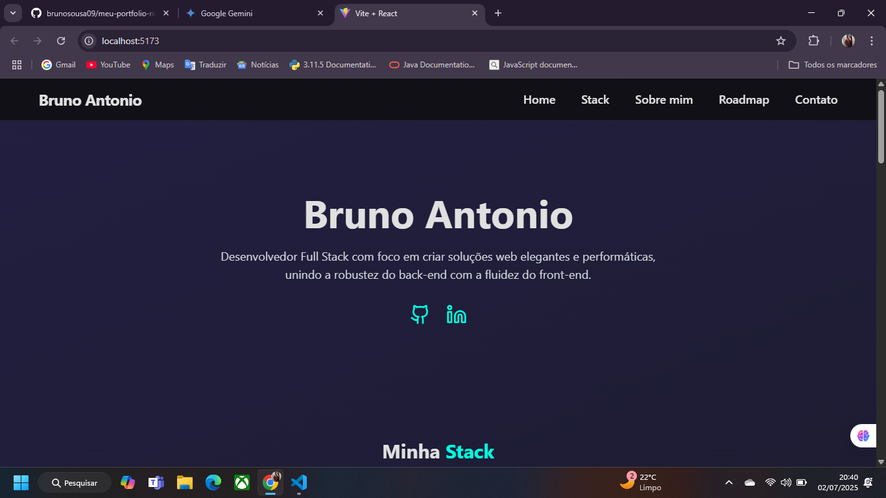

# Portfólio Pessoal - Bruno Antonio

Este é o repositório do front-end do meu portfólio pessoal, uma single-page application (SPA) desenvolvida para apresentar as minhas competências, projetos e trajetória profissional. O design é moderno, responsivo e focado numa experiência de utilizador fluida e agradável.

---



---

## ✨ Funcionalidades

- **Single-Page Application:** Navegação fluida e instantânea entre as seções sem recarregar a página.
- **Scroll Suave:** Utilização do `react-scroll` para uma rolagem suave e precisa até cada seção.
- **Totalmente Responsivo:** Design adaptado para uma visualização perfeita em desktops, tablets e telemóveis.
- **Animações Modernas:** Animações sutis de entrada e de interação implementadas com `framer-motion` para enriquecer a experiência do utilizador.
- **Componentes Reutilizáveis:** Código organizado em componentes para fácil manutenção e escalabilidade.
- **Timeline Interativa:** Um roadmap de estudos visual que mostra a minha evolução e planos futuros.
- **Formulário de Contato Funcional:** Integrado com o serviço **EmailJS** para permitir o envio de mensagens diretamente pelo site.

---

## 🚀 Tecnologias Utilizadas

Este projeto foi construído com as seguintes tecnologias de ponta no ecossistema front-end:

- **Framework/Biblioteca:** [React](https://react.dev/)
- **Build Tool:** [Vite](https://vitejs.dev/)
- **Estilização:** [Tailwind CSS](https://tailwindcss.com/)
- **Animações:** [Framer Motion](https://www.framer.com/motion/)
- **Ícones:** [Lucide React](https://lucide.dev/)
- **Scroll:** [React Scroll](https://github.com/fisshy/react-scroll)
- **Serviço de Email:** [EmailJS](https://www.emailjs.com/)

---

## ⚙️ Como Executar o Projeto Localmente

Para clonar e executar este projeto na sua máquina local, siga os passos abaixo.

1.  **Clone o repositório:**
    ```bash
    git clone [https://github.com/brunosousa09/meu-portfolio-novo.git](https://github.com/brunosousa09/meu-portfolio-novo.git)
    ```

2.  **Navegue até o diretório do projeto:**
    ```bash
    cd meu-portfolio-novo
    ```

3.  **Instale as dependências:**
    ```bash
    npm install
    ```

4.  **Configure as variáveis de ambiente (EmailJS):**
    Crie um ficheiro `.env.local` na raiz do projeto e adicione as suas chaves do EmailJS.
    ```
    VITE_EMAILJS_SERVICE_ID=seu_service_id
    VITE_EMAILJS_TEMPLATE_ID=seu_template_id
    VITE_EMAILJS_PUBLIC_KEY=sua_public_key
    ```
    *Para que isto funcione, altere a função `handleSubmit` no ficheiro `App.jsx` para usar estas variáveis:*
    ```javascript
    // De:
    emailjs.sendForm('YOUR_SERVICE_ID', 'YOUR_TEMPLATE_ID', e.target, 'YOUR_PUBLIC_KEY')

    // Para:
    emailjs.sendForm(
        import.meta.env.VITE_EMAILJS_SERVICE_ID,
        import.meta.env.VITE_EMAILJS_TEMPLATE_ID,
        e.target,
        import.meta.env.VITE_EMAILJS_PUBLIC_KEY
    )
    ```

5.  **Inicie o servidor de desenvolvimento:**
    ```bash
    npm run dev
    ```

6.  Abra [http://localhost:5173](http://localhost:5173) (ou o endereço que aparecer no terminal) no seu navegador.

---

## 🔮 Próximos Passos

Este projeto está em constante evolução. Os próximos passos planeados são:

- [ ] **Desenvolvimento do Back-end:** Criar uma API dedicada em Node.js com Express para gerir o envio de e-mails, substituindo o EmailJS por uma solução mais robusta e segura.
- [ ] **Adicionar Seção de Projetos:** Implementar uma nova seção para exibir os meus principais projetos com descrições, tecnologias e links para o GitHub e demonstrações ao vivo.
- [ ] **Testes:** Adicionar testes unitários e de integração para garantir a qualidade do código.
